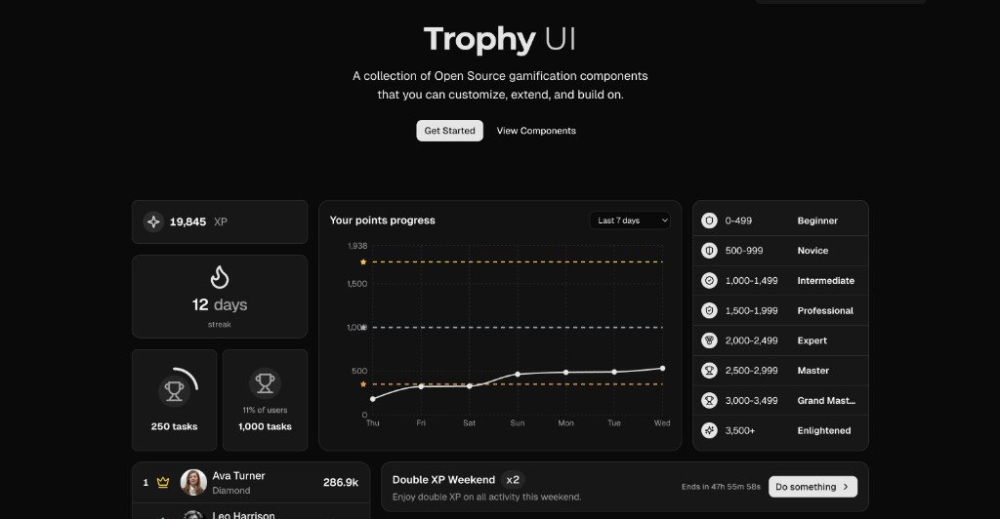

# Gamification UI Kit by Trophy

[Gamification UI Kit by Trophy](https://ui.trophy.so) is a component library built on top of [shadcn/ui](https://ui.shadcn.com/) to help you build gamification experiences faster.

## Overview

Trophy's Gamification UI Kit provides pre-built, customizable React components for gamification—streaks, achievements, leaderboards, points, XP charts, event banners, and more. The [shadcn/ui](https://ui.shadcn.com/) CLI pulls components straight from the registry so you can own the code and tailor it to your product.

## Installation

Use the shadcn CLI with the Trophy registry URL:

```bash
npx shadcn@latest add https://ui.trophy.so/streak-badge
```

## Prerequisites

Before using Trophy's Gamification UI Kit, ensure your project meets these requirements:

- **Node.js 18** or later
- **React 18+** — components are client-side React
- **Tailwind CSS v4+** configured so utility classes compile (see [semantic theme tokens](https://ui.trophy.so/docs/styles) Trophy expects)
- **shadcn/ui** initialized in your project (`npx shadcn@latest init`) with `components.json` and path aliases set up

## Usage

### Install all components

Install every registry component at once:

```bash
npx shadcn@latest add https://ui.trophy.so/all
```

This adds components (and any shared primitives they depend on) into your configured components directory.

### Install specific components

Add individual components by name:

```bash
npx shadcn@latest add https://ui.trophy.so/<component-name>
```

Examples:

```bash
npx shadcn@latest add https://ui.trophy.so/points-chart
npx shadcn@latest add https://ui.trophy.so/leaderboard-card
npx shadcn@latest add https://ui.trophy.so/streak-badge
```

### Explicit registry URLs

You can also point at the JSON registry entries directly:

```bash
npx shadcn@latest add https://ui.trophy.so/r/points-chart.json
```

Browse the component catalog at [ui.trophy.so/r/registry.json](https://ui.trophy.so/r/registry.json), or on the docs site: [Components](https://ui.trophy.so/docs/components) and the [introduction](https://ui.trophy.so/docs).

## Contributing

If you would like to contribute to Gamification UI Kit by Trophy:

1. Fork the repository
2. Create a branch for your change
3. Make your updates (registry sources live under `apps/www/registry/`)
4. Open a pull request against `main`

Read the [contributing guide](./CONTRIBUTING.md) for local setup, `pnpm registry:build`, and review expectations.

## License

Licensed under the [MIT license](https://github.com/trophyso/ui/blob/main/LICENSE.md).

Built by [Trophy](https://trophy.so).
